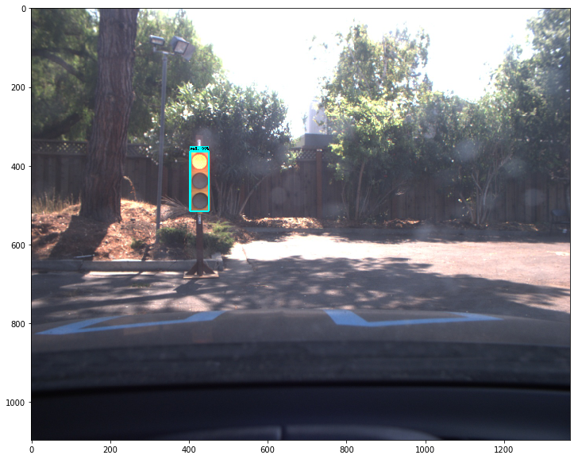

# Traffic light detection based on light-weight CNN

---
[](http://www.udacity.com/drive)

This repo is part of Udacity final project. I utilize Tensorflow Object Detection API based on SSD-MobileNetV2/SSD-InceptionV2 architecture for traffic light detection. Note that SSD-MobileNetV2 cannot be compatible with old version tensorflow, I use Tensorflow 1.13 for training.

## Training dataset 

[dataset](https://github.com/alex-lechner/Traffic-Light-Classification#training
)


## Configure Tensorflow Object Detection API


Tensorflow object detection API installation on [here](https://github.com/tensorflow/models/blob/master/research/object_detection/g3doc/installation.md)


## Modify the config file of the pretrained model

Mainly, the following items should be adapted to the new task.

* num_classes
* max_detections_per_class (origin is 100, maybe change into a lower number)
* fine_tune_checkpoint
* train_input_reader
* eval_input_reader
* batch_norm_trainable: true (maybe delete it to avoid the error)


## Google Colab for training the network

Please check the [notebook](https://github.com/karlTUM/udacity_traffic_light_detection/blob/master/google_colab_work/work/train_tf_traffic_light_detection.ipynb) for training the network.


## Results:

For training the simulation dataset, I train around 20000 iterations. Below is the Average Precision on the validation dataset during training.


*AP under different levels of IoU on the validation dataset during training*


*Detection results on simulated dataset*

---
## Real dataset

### SSD-InceptionV2

For real dataset, the image size is about 1306x1000, but the object area is very small around 20x50. In that case, I first try to increase the network detection power and  utilize SSD-InceptionV2 model based on resized 512x512 images. 

The training codes on Google Colab can be found in notebook.

Below are the results:





### SSD-MobileNetV2

The results of light-weight SSD-MobileNetV2 on real dataset is in the [notebook](https://github.com/karlTUM/udacity_traffic_light_detection/blob/master/google_colab_work/work/reference_ssd_mobilenetV2_real_data.ipynb). 

---
# update

## training dataset

I would try to use one reference model for the traffic light detection in both simulation and real cases and I found the [dataset](https://github.com/Az4z3l/CarND-Traffic-Light-Detection). 

Based on the SSD-MobileNetV2 model, I modify the configure file with:

```
num_classes: 3

image_resizer {
      fixed_shape_resizer {
        height: 512
        width: 512
      }
    }

anchor_generator {
      ssd_anchor_generator {
        num_layers: 6
        min_scale: 0.2
        max_scale: 0.95
        aspect_ratios: 0.3333
      }
    }

post_processing {
      batch_non_max_suppression {
        score_threshold: 1e-8
        iou_threshold: 0.6
        max_detections_per_class: 10
        max_total_detections: 10
      }
      score_converter: SIGMOID
    }
```
For converting the trained model on Tensorflow V1.13 to older version (Tensorflow V1.3.0), I follow the detailed [introduction](https://github.com/Az4z3l/CarND-Traffic-Light-Detection). 

The trainig and evalutaion details can be found in the [notebook](https://github.com/karlTUM/udacity_traffic_light_detection/blob/master/colab_work_new/train_ssd_mobilenetV2_traffic_dataset_mixed.ipynb).

## results


Simulation              | Real case 
:-------------------------:|:-------------------------:
  |  
 | 
 | 


